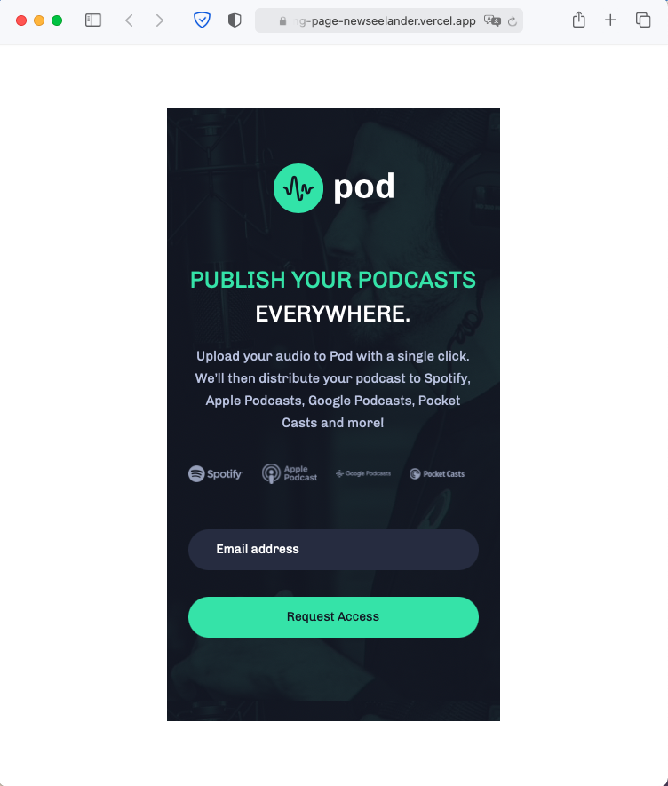
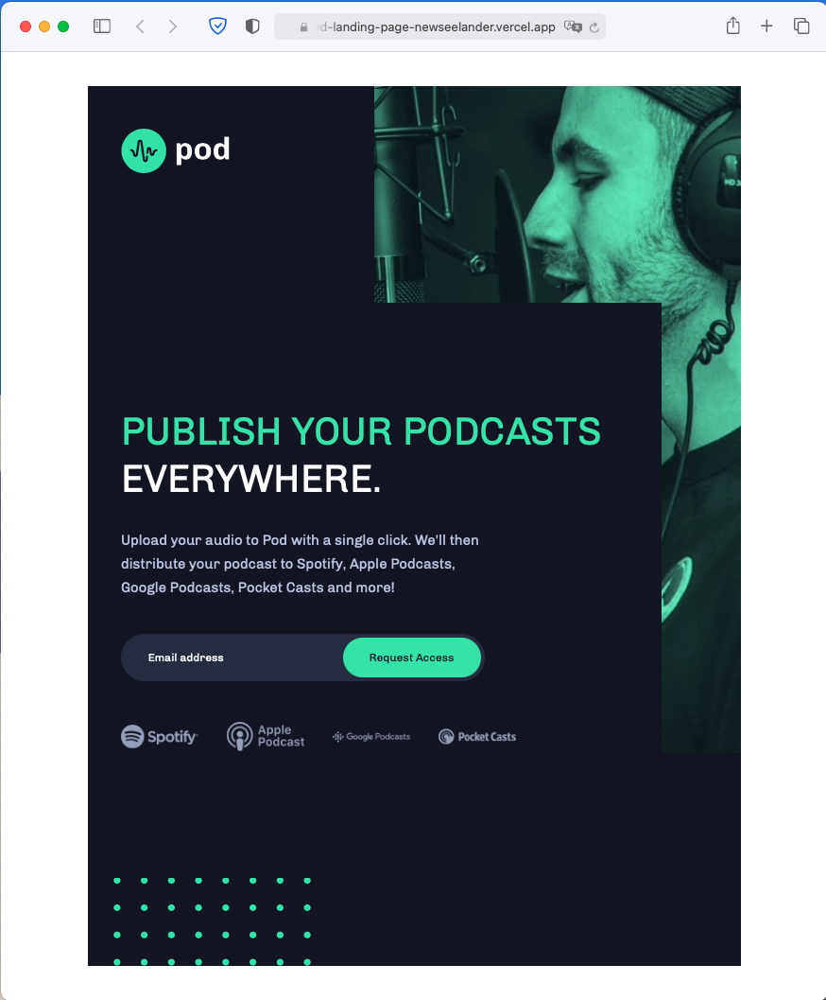

# Pod request access landing page

## Table of contents

- [Overview](#overview)
  - [The project](#the-project)
  - [Screenshot](#screenshot)
  - [Links](#links)
- [My process](#my-process)
  - [Built with](#built-with)
  - [What I learned](#what-i-learned)
  - [Continued development](#continued-development)
  - [Useful resources](#useful-resources)
- [Author](#author)
- [Acknowledgments](#acknowledgments)

## Overview

### The project

Users should be able to:

- View the optimal layout depending on their device's screen size
- See hover states for interactive elements
- Receive an error message when the form is submitted if:
  - The `Email address` field is empty should show "Oops! Please add your email"
  - The email is not formatted correctly should show "Oops! Please check your email"

### Screenshot






### Links

- GitHub: [https://github.com/dmitrymitenkoff/pod-landing-page]
- Live Site URL: [https://pod-landing-page-blond.vercel.app]

## My process

### Built with

- Semantic HTML5 markup
- Flexbox
- CSS Grid
- Mobile-first workflow
- JavaScript
- [SASS](https://sass-lang.com) - Sass - CSS extension language

### What I learned

1. It is recommended to use an explicit label instead of an implicit label when designing forms. This is because implicit labels are not handled correctly by assistive technologies, even if the "for" and "id" attributes are used. If the label is not required by the design, CSS allows us to hide the label in an accessible way. Setting display: none or visibility: hiddent is not considered accessible. To visually hide the label, I've opted to use the following code:

```html
<label class="visually-hidden" for="email">Email</label>
<input type="text" name="email" id="email" placeholder="Email address" />
```

```css
.visually-hidden {
  border-width: 0 !important;
  clip: rect(1px, 1px, 1px, 1px) !important;
  height: 1px !important;
  overflow: hidden !important;
  padding: 0 !important;
  position: absolute !important;
  white-space: nowrap !important;
  width: 1px !important;
}
```

2. Using Sass mixin functionality allowed me to apply media breakpoints directly to certain elements rather than write all media queries in one place. Eg, I set two breakpoints (for tablet and desktop) like so:

```scss
@mixin responsive($breakpoint) {
  // TABLET
  @if $breakpoint == tablet {
    @media (min-width: 768px) {
      @content;
    }
  }

  // DESKTOP
  @if $breakpoint == desktop {
    @media (min-width: 1440px) {
      @content;
    }
  }
}
```

I then applied these directly in my scss partials:

```scss
@include responsive(desktop) {
  padding-left: 16.5rem;
}
```

3. In CSS, it's possible to style placeholder text, but different prefixes are applied based on the browser:

```css
::-webkit-input-placeholder {
  /* Chrome/Opera/Safari */
  color: $color-white;
}
::-moz-placeholder {
  /* Firefox 19+ */
  color: $color-white;
}
:-ms-input-placeholder {
  /* IE 10+ */
  color: $color-white;
}
:-moz-placeholder {
  /* Firefox 18- */
  color: $color-white;
}
```

### Continued development

Use this section to outline areas that you want to continue focusing on in future projects. These could be concepts you're still not completely comfortable with or techniques you found useful that you want to refine and perfect.

**Note: Delete this note and the content within this section and replace with your own plans for continued development.**

### Useful resources

- [Example resource 1](https://www.example.com) - This helped me for XYZ reason. I really liked this pattern and will use it going forward.
- [Example resource 2](https://www.example.com) - This is an amazing article which helped me finally understand XYZ. I'd recommend it to anyone still learning this concept.

**Note: Delete this note and replace the list above with resources that helped you during the challenge. These could come in handy for anyone viewing your solution or for yourself when you look back on this project in the future.**

## Author

- Website - [Add your name here](https://www.your-site.com)
- Frontend Mentor - [@yourusername](https://www.frontendmentor.io/profile/yourusername)
- Twitter - [@yourusername](https://www.twitter.com/yourusername)

**Note: Delete this note and add/remove/edit lines above based on what links you'd like to share.**

## Acknowledgments

This is where you can give a hat tip to anyone who helped you out on this project. Perhaps you worked in a team or got some inspiration from someone else's solution. This is the perfect place to give them some credit.

**Note: Delete this note and edit this section's content as necessary. If you completed this challenge by yourself, feel free to delete this section entirely.**
